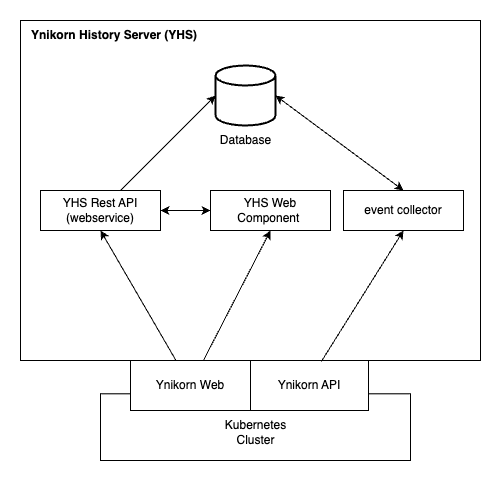

# Yunikorn History Server (YHS)

[![GoReport Widget]][GoReport Status]
[](https://github.com/armadaproject/armada-operator/releases/latest)

[GoReport Widget]: https://goreportcard.com/badge/github.com/G-Research/yunikorn-history-server

[GoReport Status]: https://goreportcard.com/report/github.com/G-Research/yunikorn-history-server

Yunikorn History Server (YHS) is an ancillary service for K8S Clusters using the Yunikorn Scheduler to
persist the state of a Yunikorn-managed cluster to a database, allowing for long-term
access to historical data of the cluster's operations (e.g. to view past Applications,
resource usage, etc.).

## Installation

### Quickstart

Use the following `make` commands to run **YHS** for a quick test.
These commands will install all the necessary dependencies in [kind](https://kind.sigs.k8s.io/docs/user/quick-start/).

#### Prerequisites

Make sure you have the following dependencies installed:

* [Docker](https://docs.docker.com/get-docker/) - containerization platform.
* [kind](https://kind.sigs.k8s.io/docs/user/quick-start/) - tool for running local Kubernetes clusters using Docker container "nodes".
* [Go v1.22+](https://golang.org/doc/install) programming language used to build the Yunikorn History Server.

##### Setup local cluster and install dependencies:

start all dependencies - if you are using kind as your K8S cluster manager:

```bash
make kind-all
```

If you want to use minikube for your cluster:

```bash
env CLUSTER_MGR=minikube make minikube-all
```

start the Yunikorn History Server:

```bash
make run
```

## Architecture

The Yunikorn History Server (YHS) is a standalone service that enhances the capabilities of the
Yunikorn Scheduler by providing long-term persistence of cluster operational data.
It achieves this by listening for events from the Yunikorn Scheduler and persisting them to a database.

<p align="center">
  
</p>

YHS is composed of three main components:

1. **Event Collector:** This component is responsible for listening to events stream API from the Yunikorn Scheduler  
   and persisting them to the database.
   It ensures that all significant operations performed by the scheduler
   are recorded for future analysis.

2. **REST API:** This component serves as the interface for retrieving historical data.
   It provides endpoints that return data about past applications, resource usage, and other operational metrics. Also provides
   querying capabilities to filter and retrieve specific data.

3. **Web Frontend:** This component enhances the existing Yunikorn Web interface by providing additional features that utilize
   the historical data stored by YHS. It is loaded on the application page of Yunikorn Web.
   More details on the web component is available [here](web/README.md).

By integrating these components, YHS provides a comprehensive view of the historical operations of a Yunikorn-managed cluster,
enabling detailed analysis and insights.

## Contributing

We welcome and appreciate your contributions!

### General

Report issues, request features, and ask questions
using [GitHub Issues](https://github.com/G-Research/yunikorn-history-server/issues/new).

### Code Contributions

If you'd like to contribute code, please follow these guidelines:

**Open an Issue:** Before starting work, ensure there is a relevant issue that your contribution addresses.
If none exists, consider creating one to discuss the proposed changes or features.

**Fork the Repository:** Create your own fork of the repository to make your changes.

**Make Your Changes:** Implement your changes in your fork, adhering to the project's coding standards and best practices.

**Run Tests:** Ensure that all tests pass and that your code does not introduce any new issues.
All CI checks must pass before submitting your code. Refer to the [Testing](#testing) section for more information.

**Submit a Pull Request:** Open a pull request to the main repository. Please reference the issue your PR addresses in the description.
Clearly explain the changes you’ve made and why they are necessary.

**Review Process:** Your pull request will be reviewed by the maintainers. Be prepared to make additional changes based on feedback.
We usually require at least two maintainers to approve the PR before merging.

Thank you for contributing to our project! Your efforts help us improve and grow the project together ❤️

### Testing

Please test contributions thoroughly before requesting reviews. Add and change appropriate unit and integration tests to ensure your changes
are covered by automated tests and appear to be correct.

#### Check Linting

```bash
make lint
```

#### Run tests

Run tests using `kind` for cluster manager:
```bash
make tests
```

Run tests using `minikube` for cluster manager:
```bash
env CLUSTER_MGR=minikube make tests
```
should all succeed without error.

## License

See the [LICENSE](LICENSE) file for licensing information.
